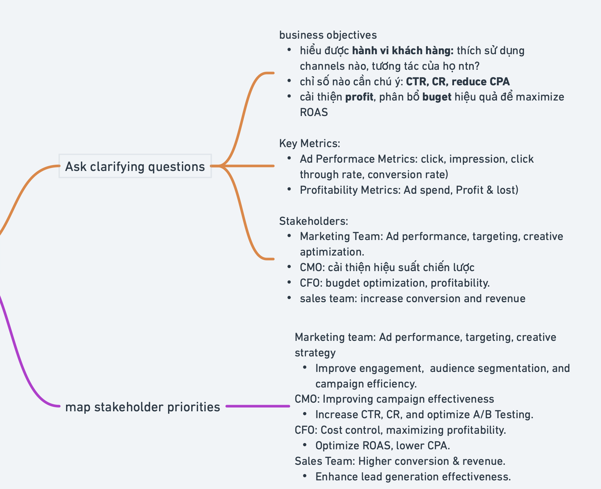
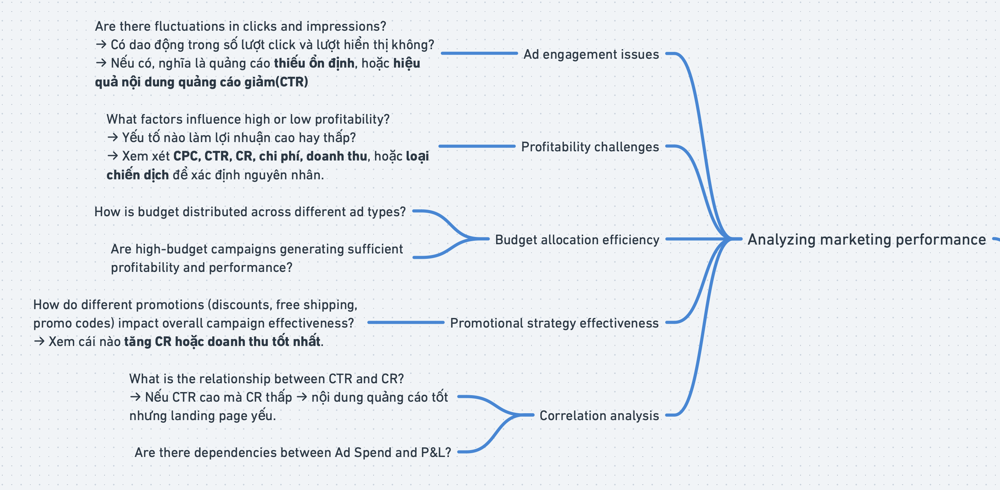

# CON CUNG – BUSINESS ANALYSIS

## 1. Phân tích Business Domain

### a. Business Model

- **Khách hàng mục tiêu:** Các bà mẹ, gia đình có trẻ nhỏ (sữa, tã, đồ dùng cho bé, chăm sóc mẹ)
- **Kênh phân phối:**
  - Online: website thương mại điện tử, app mobile, sàn TMĐT, livestream, social commerce
  - Offline: hệ thống cửa hàng Con Cưng toàn quốc
- **Nguồn thu:** Doanh thu bán hàng sản phẩm mẹ & bé (sữa, tã, chăm sóc sức khỏe, đồ dùng trẻ em ...)
- **Cơ cấu chi phí:** Nhập hàng & tồn kho, vận hành kho + logistics + giao hàng, marketing, nhân sự, mặt bằng, công nghệ
- **Liên kết & đối tác:** Nhà cung cấp, vận chuyển, nền tảng thanh toán, đối tác quảng cáo/digital, đối tác công nghệ
- **Proposition (giá trị cốt lõi):** "chính hãng", "giao nhanh 1h/siêu tốc", "ưu đãi + voucher", đa kênh, dịch vụ hậu mãi, CSKH tốt

### b. Quy trình vận hành chính

1. **Tiếp thị / thu hút khách hàng**
   - Marketing digital (Google Ads, Facebook, SEO, KOL, livestream)
   - Quảng cáo offline / truyền thống
   - Chương trình khuyến mãi / voucher
   - Nội dung & social media (blog, video, hướng dẫn)
2. **Chuyển đổi khách truy cập → đơn hàng**
   - Truy cập website/app → chọn sản phẩm → giỏ → thanh toán
   - Tích hợp kho (check tồn kho)
   - Xử lý đơn hàng (xác nhận, kiểm tra kho, phân bổ)
3. **Quản lý tồn kho, kho & logistics**
   - Nhập hàng, kiểm nhận
   - Lưu kho, điều phối kho vùng
   - Chuẩn bị đơn hàng (picking, packing)
   - Giao hàng (đối tác/shipper nội bộ)
   - Theo dõi trạng thái giao hàng
4. **Chăm sóc khách hàng & đổi trả**
   - CSKH qua hotline, chat, email, social
   - Xử lý khiếu nại, trả/đổi hàng
   - Thu thập feedback, đánh giá
   - Chăm sóc khách hàng cũ: remarketing, voucher, gợi mua lại
5. **Quản lý & phân tích hoạt động**
   - Giám sát KPI các bộ phận
   - Báo cáo doanh thu, tồn kho, hiệu suất marketing, chi phí vận chuyển
   - Dự báo nhu cầu, lập kế hoạch tồn kho & đơn hàng

---

## 2. Xác định các Data Sources

| Data Source          | Nội dung / dữ liệu chính                                    | Ghi chú / thiết lập                     |
| -------------------- | ----------------------------------------------------------- | --------------------------------------- |
| CRM                  | Thông tin khách hàng, lịch sử mua, đánh giá, khiếu nại      | Tích hợp website/app + cửa hàng + CSKH  |
| ERP                  | Quản lý mua hàng, tồn kho, đơn hàng, chi phí, tài chính     | Hệ thống chủ chốt vận hành nội bộ       |
| E-commerce (Web/App) | Dữ liệu truy cập, session, chuyển đổi, giỏ hàng, đơn online | Dữ liệu front-end quan trọng            |
| POS                  | Đơn hàng tại cửa hàng, thanh toán tại quầy                  | Đồng bộ với ERP/CRM                     |
| Logistics            | Trạng thái vận chuyển, chi phí, đối soát                    | Từ đối tác hoặc hệ thống nội bộ         |
| Social Media/Digital | Dữ liệu chiến dịch quảng cáo, tương tác, CPC/CPM, ROI       | Liên tục ingest vào hệ thống phân tích  |
| Livestream/Video     | Tương tác, đơn hàng từ livestream, chuyển đổi video         | Quan trọng nếu dùng livestream bán hàng |
| CSKH (ticketing)     | Yêu cầu, phản hồi, khiếu nại, đánh giá, thời gian xử lý     | Theo dõi chất lượng dịch vụ             |
| Ngoài/Phụ trợ        | Dữ liệu thị trường, ngành, bảng giá, đối thủ, thời tiết     | Hỗ trợ phân tích chiến lược             |

---

## 3. Xác định Key Stakeholders

| Stakeholder/Bộ phận | Vai trò/Trách nhiệm                             | Loại dữ liệu/báo cáo                                                                             |
| ------------------- | ----------------------------------------------- | ------------------------------------------------------------------------------------------------ |
| CEO/Ban lãnh đạo    | Quyết định chiến lược                           | Dashboard tổng thể: doanh thu, lợi nhuận, tăng trưởng, chi phí, ROI, KPI cao cấp                 |
| Tài chính/Kế toán   | Kiểm soát chi phí, báo cáo tài chính            | Doanh thu theo kênh, chi phí marketing/vận chuyển, lợi nhuận biên, công nợ, CLV                  |
| Marketing/Digital   | Quản lý chiến dịch, tối ưu ngân sách            | Hiệu suất quảng cáo (CPC/CPM, ROAS, conversion rate), phân tích kênh, chi phí/lợi ích chiến dịch |
| Sales/Bán hàng      | Quản lý doanh số, kênh bán hàng                 | Doanh số theo khu vực/kênh, sản phẩm bán chạy, tỷ lệ chuyển đổi, AOV                             |
| Logistics/Vận hành  | Điều phối vận chuyển, kho, đơn hàng             | Tồn kho, tốc độ xử lý đơn, chi phí vận chuyển, OTD, tỷ lệ trả/hủy                                |
| CSKH                | Giải quyết khiếu nại, giữ chân khách            | Ticket, thời gian phản hồi, CSAT, tỷ lệ hoàn trả, phản hồi sau mua                               |
| IT/Data/BI          | Hệ thống, tích hợp dữ liệu, dashboard           | Cấu trúc dữ liệu, pipeline ETL, bảo trì hệ thống, hỗ trợ truy vấn/báo cáo                        |
| Quản lý cửa hàng    | Quản lý nhân viên, hiệu quả kinh doanh cửa hàng | Doanh số, tồn kho, hiệu suất bán, xếp hạng cửa hàng                                              |

---

## 4. Phân tích Reporting Requirement

### a. Mục đích, chỉ số chính và các bên liên quan

### b. Phân tích giả thuyết, insight, giải pháp

### c. Dashboard cho các cấp

| Cấp quản lý               | Dashboard/Báo cáo gợi ý                                    | Tần suất cập nhật      |
| ------------------------- | ---------------------------------------------------------- | ---------------------- |
| CEO/Ban lãnh đạo          | Tổng quát: KPI chính, so sánh mục tiêu, xu hướng           | Hàng ngày/tuần         |
| Quản lý kênh/Marketing    | Chiến dịch: hiệu suất quảng cáo, funnel chuyển đổi         | Gần real-time/hàng giờ |
| Quản lý sản phẩm/danh mục | Doanh số theo SKU/thương hiệu, margin, tồn kho lâu         | Hàng ngày/tuần         |
| Quản lý kho/logistics     | Tồn kho, đơn chưa xử lý, giao đúng hạn, chi phí vận chuyển | Hàng ngày              |
| CSKH                      | Ticket, thời gian xử lý, hoàn trả, đánh giá khách hàng     | Theo ca/hàng ngày      |
| Trưởng cửa hàng           | Doanh số, biến động theo giờ, so sánh mục tiêu, tồn kho    | Hàng ngày              |
